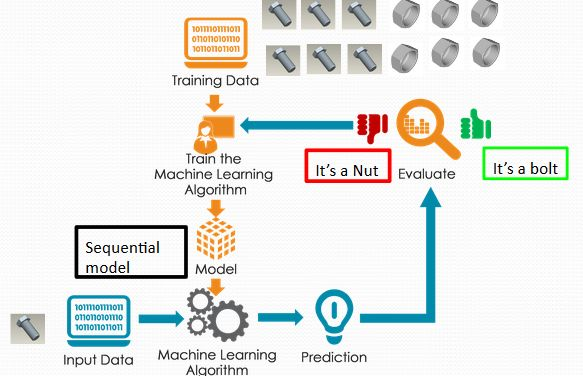

## Introduction

Artificial intelligence has become a boom in the current generation, many operations have become very easy to handle and work efficient for humans. AI can learn and analyze vast amounts of data. 
So, our team has decided to make a project on a sub-part of Artificial intelligence, i.e, the Deep Learning Concept. The motive of this project is to detect the type of fastener by looking at its picture. This is achieved by calculating the losses and accuracy of the model we had trained using sequential model of convolutional neural networks in deep learning. As we are dealing with mechanical engineering, the idea of detecting the mechanical parts (i.e fasteners) was decided. 
An algorithm is able to classify images(efficiently) by using a Machine Learning algorithm called Convolutional Neural Networks(CNN), a method used in Deep Learning. This algorithm is inspired by the working of a part of the human brain which is the Visual Cortex. 

## Objective

To detect the fastener we use the concept of Deep learning which is a sub part of machine learning and mainly when it comes to image classification, we need to use CNN (Convolutional Neural Networks). A simple version of this model called Sequential is used to train the model to distinguish images into different classes. We have collected the data of 4 classes of fasteners(nuts, bolts, locating pin, and washer), each of 238 types, and this dataset is used to detect the fastener with 97% accuracy. 

## Imported Libraries

os: works related to operating system can be done. 
glob: used to return bunch of files from given folders. 
Numpy : Numpy module’s functions are very useful for performing any mathematical or scientific calculation. 
Pandas : to work with csv files and data frames. It is used for exploring , cleaning , transforming and visualizing data. 
Matplotlib: Matplotlib is a comprehensive library for creating static , animated and interactive visualizations of data in python.
imread: used to change image into array
rescale,resize: used to adjust the size of image
train_test_split: used to divide the given data into training and testing with given random state
confusion_matrix: used to evaluate the performance of a classification model through the calculation of performance metrics like accuracy, precision, recall
keras: used for distributed training of deep learning models.
sequential: used for creating neural networks by adding new layers .
Seaborn: Seaborn is a python data visualization library based on matplotlib. It provides a high-level interface for drawing attractive and informative statistical graphics.

# Data Processing

## Data Collection 

We have worked on 4 classes of fasteners, i.e. (nut,bolt,locating pin,washer). Data of 238 types of each class has been downloaded from different part libraries available on the internet . Each part consists of 8 isometric views and a total of [238(parts)*4(classes)*8(isometric views)], i.e 7616 images were considered a data set for this program.

## Data Preparation

Each type of part along with its 8 isometric views are stored in 4 different class’s folders and all images are taken in 224 X 224 pixels. 
We checked whether all the images extracted from the data are unique or not using numpy and then we created an array of the images.

A new list was created and all the 7616 images were turned into grayscale using “as_gray” from imread function then grayscale images are formed and then they are appended to the list and then stored it into an array. 
Next we initialize an array to change the shape to a 4-Dimensional array as CNN can deal with only 4-D arrays.
Further using Matplotlib, each image dimension is depicted and the graph of each fastener was plotted and the black background for the graph was used after applying the cmap function.

## Methodology

The major methodology used in this project revolves around CNN and its sub part Sequential. Our code is completely compiled on Python by importing all the necessary libraries and making predictions about the fasteners using the data.
We have also used functions such as One hot encoding, Activation functions and Confusion matrix to arrange the data and make predictions in an organised and easily understandable manner.

## Model Analysis

Epochs:  These indicate the number of passes of the entire training dataset the machine learning algorithm has completed. Epochs calculate the loss, accuracy, validation loss, and validation accuracy.
We have taken the number of epochs as 9 because beyond this number the model gets over-trained and at this number of epochs value loss is minimum and also accuracy is pretty good. So we took the number of epochs as 9.
Also, data sets are usually grouped into batches and here we have divided them into groups of 64 . So each batch consists of 7616/64 i..e, 119 number of images.

 
